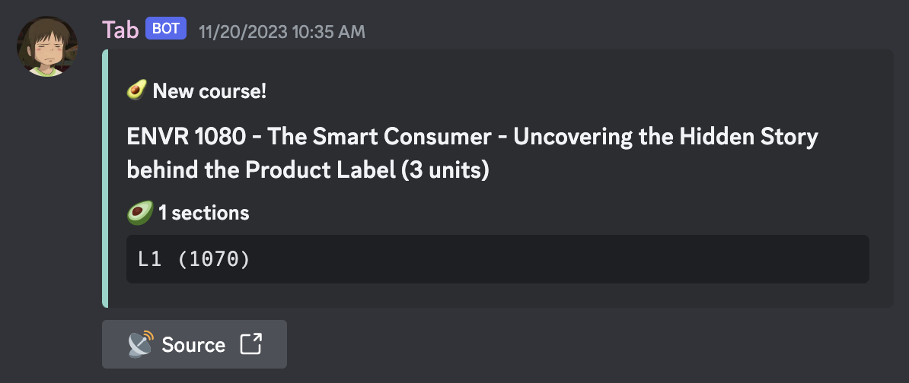
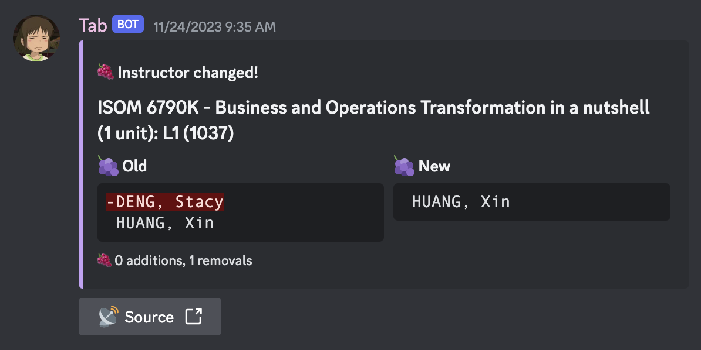
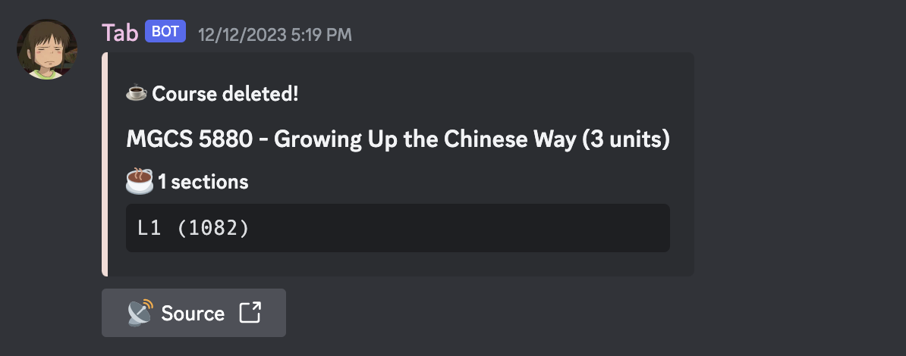
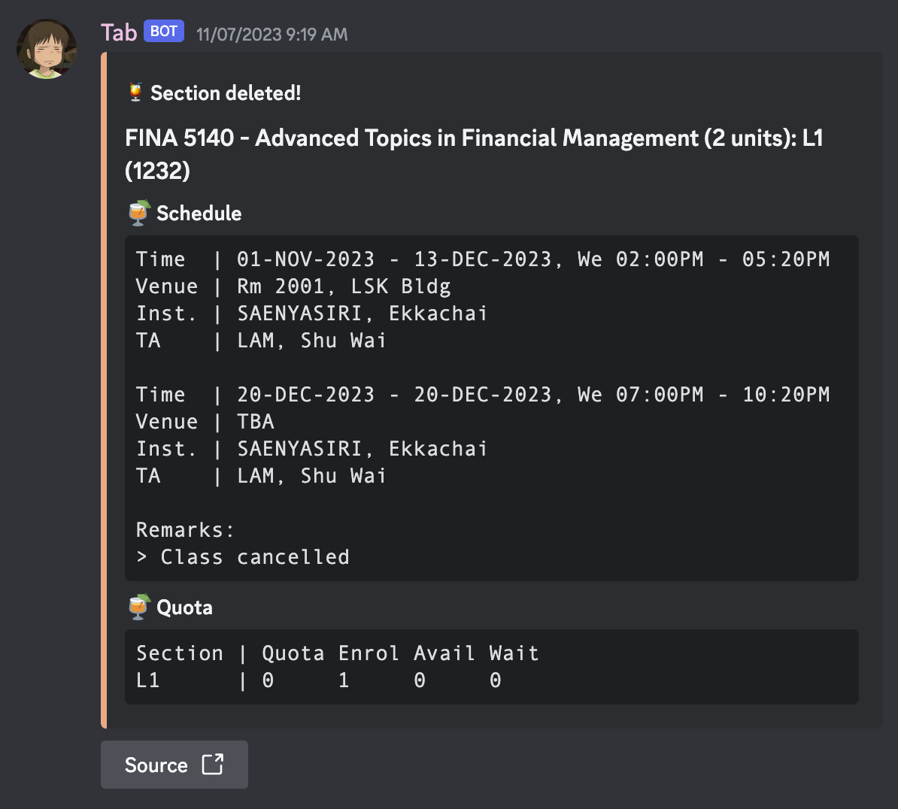

# 🍄 tab-bot

Two Discord bots that does helpful stuff with course quotas in HKUST! 🐈‍⬛

https://discord.gg/RNmMMF6xHY

## 🥁 Tab
Tab searches the servers of UST to get course data and look for quota changes!

- Tab [se](https://youtu.be/FXsGCieXm1E)nds notifications to a Discord server when changes are recorded!
- It updates every 1.5 minutes to catch changes as quickly as possible!

## 🍦 Hill
Hill uses data collected by Tab to provide course info on demand! Using its slash commands, you can check:

- Quotas
- Sections (schedules, venues, instructors)
- General information (pre-reqs, exclusions, descriptions)

of a course!

Hill can also be added to other servers!

---

## 🖼️ Screenshots
|||
| :---         | :---    |
| Tab: a new course is added |  |
| Tab: a new section (of an existing course) is added |  |
| Tab: the quota of a section is changed |  |
| Tab: the date & time of a section is changed |  |
| Tab: the venue of a section is changed |  |
| Tab: the instructor of a section is changed |  |
| Tab: the remarks of a section is changed |  |
| Tab: the info of a course is changed |  |
| Tab: a course is deleted |  |
| Tab: a section (of a course) is deleted |  |
|||
| Using Hill's command: `/info` |  |
| Using Hill's command: `/sections` |  |
| Using Hill's command: `/quota` |  |
---

## 🌟 Credits
Tab and Hill are made possible by the following projects:
- [evnchn/Course-Quota-Online](https://github.com/evnchn/Course-Quota-Online): Uses the same technologies as this project!
- [henveloper/discord-ustquotatracker](https://github.com/henveloper/discord-ustquotatracker): The original UST course quota tool!
- [HKUST Class Schedule & Quota](https://w5.ab.ust.hk/wcq/cgi-bin/): The *original* original course quota website from UST!