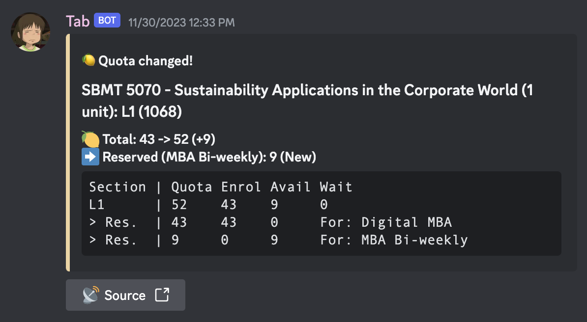
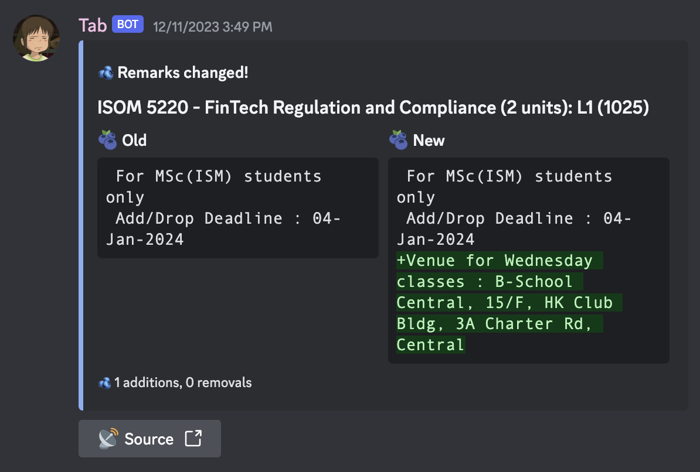

<h1 align="center">
    🍄
     
    tab-bot
</h1>

<h3 align="center">
    Two Discord bots that does helpful things with course data in HKUST! 
</h3>

    🐈‍⬛

    Try them out in our <a href="https://discord.gg/RNmMMF6xHY">server</a>!

## 🥁 Tab
Tab searches the servers of HKUST to get course data and look for changes!

- Tab sends notifications to you when changes are recorded!
- It updates every 1.5 minutes to catch changes as quickly as possible!

## 🍦 Hill
Hill uses data collected by Tab to provide course info on demand! Using its slash commands, you can look up:

- Quotas
- Sections (schedules, venues, instructors)
- General information (pre-reqs, exclusions, descriptions)
- Courses by course code prefix, Common Core area, and instructor

Hill can also be added to other servers!

## 🍋 Course notifications
Our bots work together to notify you of changes to courses you care about! There are two ways to receive course notifications.

- **✨ New! ✨** Course subscriptions 
Subscribe to a course using Hill's commands, and Tab will DM you about its changes! You're in control of what you receive, course by course! 
    > [⚠️](https://youtu.be/FXsGCieXm1E) Discord only allows DMs between users sharing a mutual server. Even if you subscribed from another server, you're recommended to join our server so Tab can DM you!
- Course channels 
Tab also sends course notifications to our server, sorted into channels by course code prefix. You can toggle notifications for all courses with the same prefix by customizing notification settings for each course channel.

## 🖼️ Screenshots

🥁 Tab

|||
| :---         | :---    |
| A new course is added |  |
| A new section (of an existing course) is added |  |
| The quota of a section is changed |  |
| The date & time of a section is changed |  |
| The venue of a section is changed |  |
| The instructor of a section is changed |  |
| The remarks of a section is changed |  |
| The info of a course is changed |  |
| A course is deleted |  |
| A section (of a course) is deleted |  |
|||

🍦 Hill

|||
| :---         | :---    |
| `/info` |  |
| `/sections` |  |
| `/quota` |  |
| `/search` by course code prefix |  |
| `/search` by Common Core area |  |
| `/search` by instructor |  |
| `/history info` |  |
| `/history sections` |  |
| `/history quota` |  |
| `/history search` |  |
| `/sub sub` |  |
| `/sub unsub` |  |
| `/sub show` |  |
|||

---

## 🌟 Credits
Tab and Hill are made possible by the following projects:
- [evnchn/Course-Quota-Online](https://github.com/evnchn/Course-Quota-Online): Uses the same technologies as this project!
- [henveloper/discord-ustquotatracker](https://github.com/henveloper/discord-ustquotatracker): The original UST course quota tool!
- [HKUST Class Schedule & Quota](https://w5.ab.ust.hk/wcq/cgi-bin/): The *original* original course quota website from HKUST!
